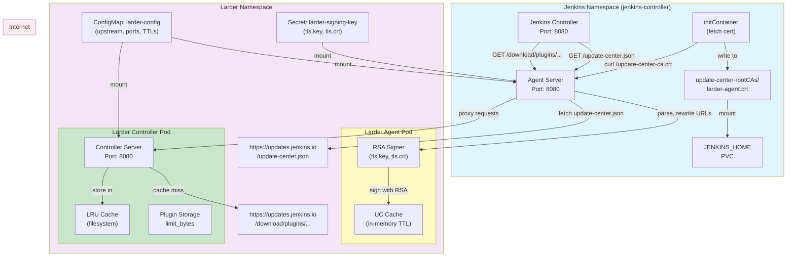
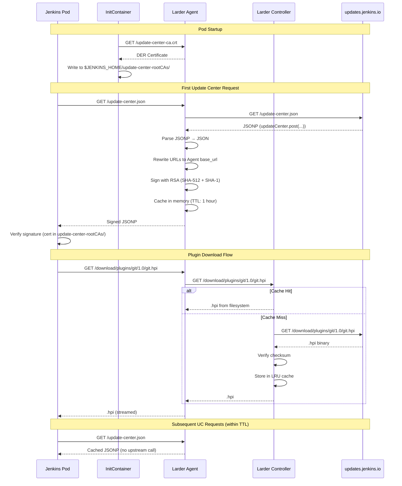
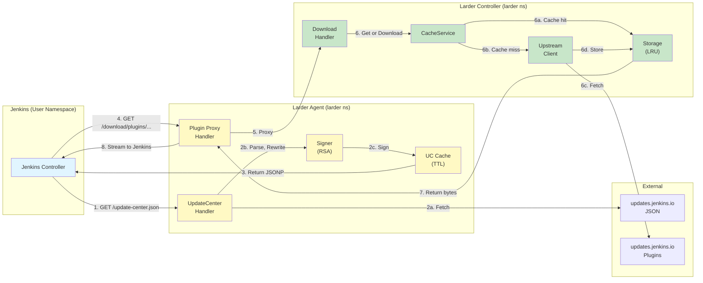
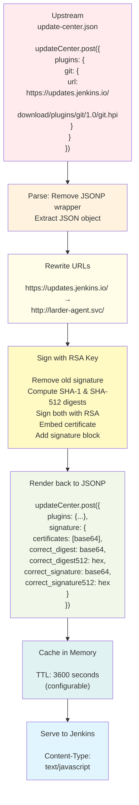
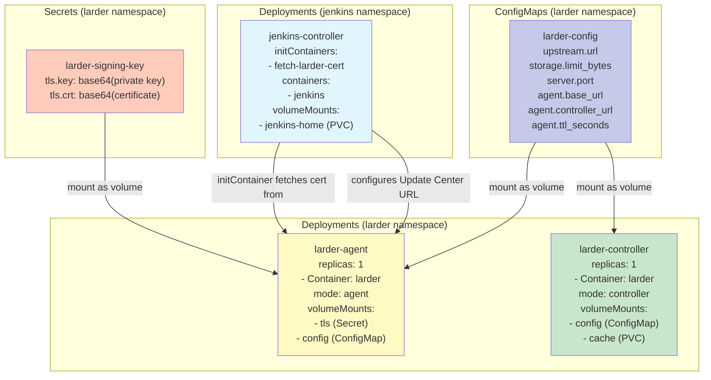
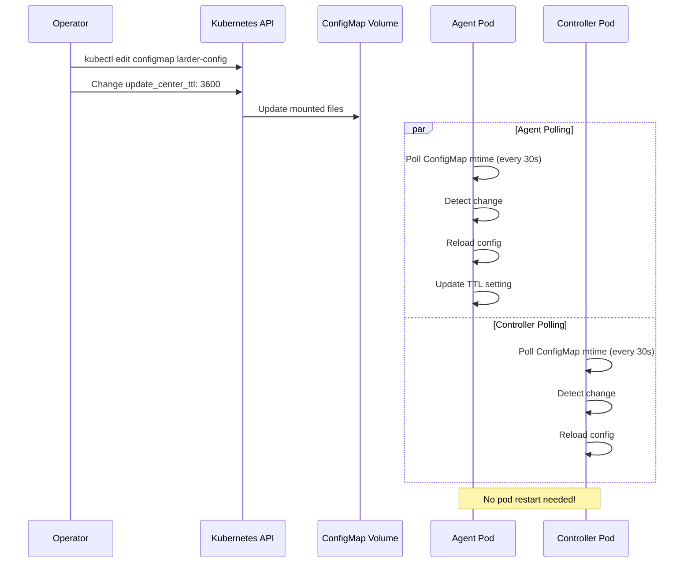
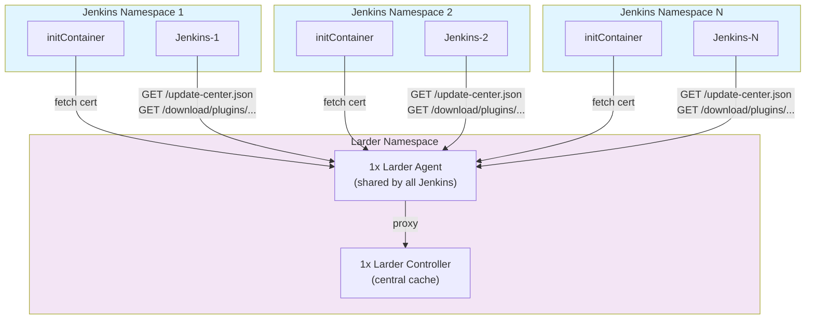
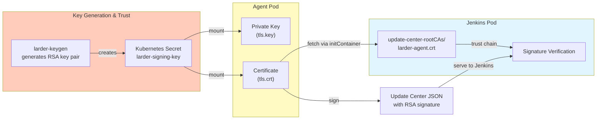

# Larder Architecture

## Overall System Design

## Request Flow Sequence

## Component Interactions

## Data Flow: Update Center JSON Processing

## Kubernetes Resources

## Hot Reload Configuration Flow

## Multi-Jenkins Deployment

## Certificate Trust Chain

