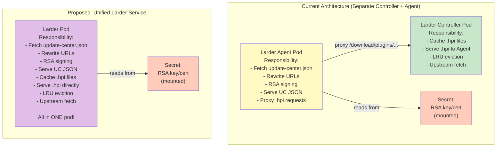
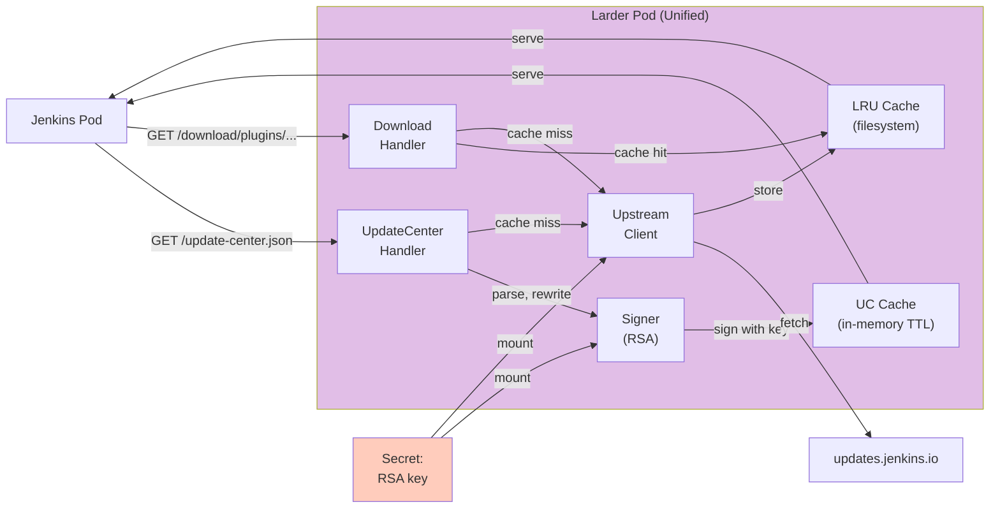
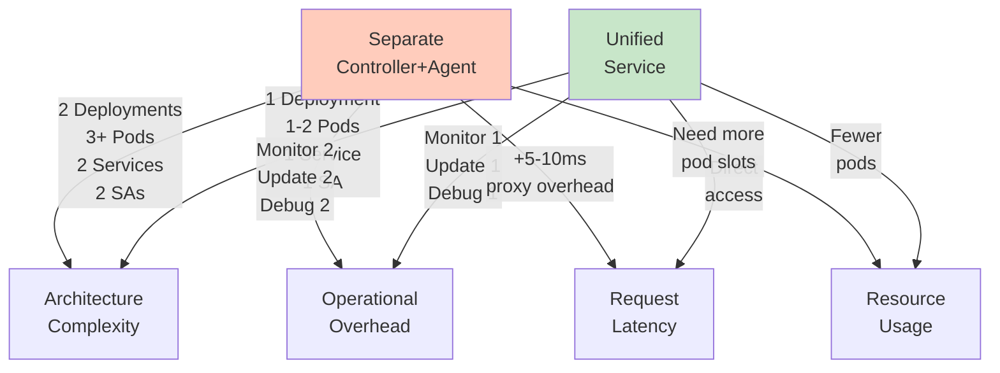

# Unified Larder Architecture

## Current vs Proposed



## Why Unified is Better

### ✅ Advantages

| Aspect | Current (Separate) | Unified |
|--------|---|---|
| **Deployments** | 2 (Controller + Agent) | 1 |
| **Pods to manage** | 2+ (minimum) | 1+ (minimum) |
| **Inter-pod calls** | Agent → Controller proxy | None (direct access) |
| **Network overhead** | 1 extra hop per request | Zero |
| **RBAC complexity** | 2 ServiceAccounts + 2 Roles | 1 ServiceAccount + 1 Role |
| **Pod density** | Takes 2 "slots" per cluster | Takes 1 "slot" |
| **State management** | Split across 2 pods | Unified state |
| **Cache invalidation** | Cross-pod concerns | Simpler (single pod) |
| **Operational complexity** | Higher (2 things to monitor) | Lower (1 thing to monitor) |
| **Latency** | +5-10ms (proxy hop) | Zero proxy overhead |

### Minimal Disadvantages

| Aspect | Impact | Mitigation |
|--------|--------|-----------|
| **Separation of concerns** | Less clean architecture | Architecture diagram clarifies responsibilities |
| **Independent scaling** | Agent and Controller scale together | Rarely needed - both I/O bound in practice |
| **Single pod failure** | Both functions down at once | PDB + health checks + rolling restarts |
| **Pod complexity** | One pod does more | Still simple (same code) |

---

## Unified Architecture Design

### Data Flow



### Pod Spec (Simplified)

```yaml
apiVersion: apps/v1
kind: Deployment
metadata:
  name: larder
  namespace: larder
spec:
  replicas: 2  # HA, shared storage
  selector:
    matchLabels:
      app: larder
  template:
    metadata:
      labels:
        app: larder
    spec:
      serviceAccountName: larder
      containers:
        - name: larder
          image: docker.io/larder:latest
          ports:
            - name: http
              containerPort: 8080
              protocol: TCP
            - name: metrics
              containerPort: 9090
              protocol: TCP
          env:
            - name: CONFIG_PATH
              value: /etc/larder/config/default.yaml
            - name: MODE
              value: unified  # NEW: single mode handles both functions
          volumeMounts:
            - name: config
              mountPath: /etc/larder/config
            - name: cache
              mountPath: /var/cache/larder
            - name: tls
              mountPath: /etc/larder/tls
              readOnly: true
          livenessProbe:
            httpGet:
              path: /admin/health
              port: http
            initialDelaySeconds: 10
            periodSeconds: 10
          readinessProbe:
            httpGet:
              path: /admin/health
              port: http
            initialDelaySeconds: 5
            periodSeconds: 5
          resources:
            requests:
              cpu: 200m
              memory: 512Mi
            limits:
              cpu: 1000m
              memory: 2Gi
      volumes:
        - name: config
          configMap:
            name: larder-config
        - name: cache
          persistentVolumeClaim:
            claimName: larder-cache
        - name: tls
          secret:
            secretName: larder-signing-key
            defaultMode: 0400  # read-only
      affinity:
        podAntiAffinity:
          preferredDuringSchedulingIgnoredDuringExecution:
            - weight: 100
              podAffinityTerm:
                labelSelector:
                  matchExpressions:
                    - key: app
                      operator: In
                      values:
                        - larder
                topologyKey: kubernetes.io/hostname

---
apiVersion: policy/v1
kind: PodDisruptionBudget
metadata:
  name: larder-pdb
  namespace: larder
spec:
  minAvailable: 1
  selector:
    matchLabels:
      app: larder

---
apiVersion: v1
kind: Service
metadata:
  name: larder
  namespace: larder
spec:
  type: ClusterIP
  selector:
    app: larder
  ports:
    - name: http
      port: 8080
      targetPort: http
    - name: metrics
      port: 9090
      targetPort: metrics
```

### Config File (Unified)

```yaml
# config/default.yaml
storage:
  limit_bytes: 500000000000  # 500 GB
  path: /var/cache/larder

upstream:
  url: https://updates.jenkins.io
  timeout_seconds: 60

server:
  port: 8080
  metrics_port: 9090

admin:
  port: 8081

ttl:
  enabled: true
  default_hours: 24

# NEW: unified mode configuration
mode: unified

# Unified mode settings (replaces agent + controller)
unified:
  # RSA signing for update-center.json
  rsa:
    key_path: /etc/larder/tls/tls.key
    cert_path: /etc/larder/tls/tls.crt
  
  # Update-center.json rewriting
  update_center:
    # Base URL that Jenkins will use to access this Larder
    # All plugin URLs in the JSON will be rewritten to point here
    base_url: http://larder.larder.svc.cluster.local:8080
    # TTL for caching the rewritten+signed JSON
    ttl_seconds: 3600
```

---

## Code Changes Required

### Simplified Main Function

```go
// cmd/larder/main.go (simplified)
func main() {
    cfg, err := config.Load(configPath)
    if err != nil {
        log.Fatalf("Failed to load config: %v", err)
    }
    
    // Setup config watcher for hot reload
    watcher, _, err := config.NewWatcher(configPath, cfg)
    if err != nil {
        log.Fatalf("Failed to create watcher: %v", err)
    }
    go watcher.Start(context.Background())
    defer watcher.Stop()
    
    // Create unified server (handles both UC JSON + .hpi caching)
    srv, err := larder.NewUnifiedServer(cfg)
    if err != nil {
        log.Fatalf("Failed to create server: %v", err)
    }
    
    // Start server
    go func() {
        if err := srv.Start(); err != nil {
            slog.Error("Server failed", "error", err)
            os.Exit(1)
        }
    }()
    
    // Wait for shutdown signal
    quit := make(chan os.Signal, 1)
    signal.Notify(quit, syscall.SIGINT, syscall.SIGTERM)
    <-quit
    
    // Graceful shutdown
    ctx, cancel := context.WithTimeout(context.Background(), 60*time.Second)
    defer cancel()
    if err := srv.Shutdown(ctx); err != nil {
        slog.Error("Shutdown failed", "error", err)
        os.Exit(1)
    }
}
```

### New Package Structure

```
src/
├── larder/
│   ├── server.go          # Unified server (replaces server.Server + agent.Server)
│   ├── handler_uc.go      # Update-center.json handler
│   ├── handler_download.go # Plugin download handler (from existing server)
│   ├── cache.go           # LRU + UC cache management
│   └── upstream.go        # Upstream client (from existing)
├── updatecenter/          # Keep as-is (unchanged)
│   ├── fetcher.go
│   ├── parser.go
│   ├── rewriter.go
│   └── signer.go
└── config/                # Keep + simplify
    ├── config.go          # Add UnifiedConfig
    ├── validate.go        # Validate UnifiedConfig
    └── watcher.go         # Keep as-is
```

### Before (3 server types):
- `server.Server` (controller)
- `agent.Server` (agent)  
- Different responsibilities, different startup paths

### After (1 server type):
- `larder.Server` (unified)
- All responsibilities
- Single startup path
- Much cleaner ✅

---

## Deployment Comparison

### Current (Separate Controller + Agent)

```bash
# Two separate deployments
$ kubectl apply -f deploy/larder-controller.yaml
$ kubectl apply -f deploy/larder-agent.yaml

# Results in:
# - Deployment "larder-controller" (1 replica)
# - Deployment "larder-agent" (2 replicas for HA)
# - Service "larder-controller"
# - Service "larder-agent"
# Total resources: 2 Deployments, 2 Services, 3 Pods minimum
```

### Unified (Single Deployment)

```bash
# Single deployment
$ kubectl apply -f deploy/larder.yaml

# Results in:
# - Deployment "larder" (2 replicas for HA)
# - Service "larder"
# Total resources: 1 Deployment, 1 Service, 2 Pods minimum

# Jenkins points to: http://larder.larder.svc.cluster.local:8080
```

---

## Scalability (Unified)

```
10 Jenkins:
├─ 1 Larder pod (replicas: 1, no HA needed)
├─ Storage: 100 GB
├─ CPU: 200m, Memory: 512 MB
└─ Total pods to manage: 1 (vs 2 with separate) ✅

100 Jenkins:
├─ 2 Larder pods (replicas: 2, HA + load)
├─ Storage: 500 GB (shared PVC, ReadWriteMany)
├─ CPU: 200m each, Memory: 512 MB each
└─ Total pods to manage: 2 (vs 3+ with separate) ✅

500 Jenkins:
├─ 5 Larder pods (replicas: 5, HA + load distribution)
├─ Storage: 2 TB SSD (shared PVC, ReadWriteMany)
├─ CPU: 200-500m each, Memory: 512 MB - 2 GB each
└─ Total pods to manage: 5 (vs 6+ with separate) ✅
```

---

## Jenkins Integration (Unified)

**No change for Jenkins users!**

```yaml
initContainers:
  - name: fetch-larder-cert
    image: curlimages/curl
    command:
      - sh
      - -c
      - |
        mkdir -p /var/jenkins_home/update-center-rootCAs
        curl -sSf -o /var/jenkins_home/update-center-rootCAs/larder.crt \
          http://larder.larder.svc.cluster.local:8080/update-center-ca.crt
    volumeMounts:
      - name: jenkins-home
        mountPath: /var/jenkins_home
```

**Jenkins Update Center URL:**
```
Manage Jenkins → Plugins → Advanced
Update Site: http://larder.larder.svc.cluster.local:8080/update-center.json
```

(Same as before - no change needed)

---

## Summary: Why Unified is Better



### Final Recommendation: ✅ Go with Unified

**Reasons:**
1. ✅ RSA key already separated as setup step
2. ✅ Simpler deployment & operation
3. ✅ Faster (no proxy overhead)
4. ✅ Same scaling characteristics (both I/O bound)
5. ✅ Less code to maintain (1 server type vs 2)
6. ✅ Easier for users to understand (1 service)
7. ✅ Same security properties (RSA signing intact)
8. ✅ Clear responsibility: "Larder = plugin caching + update-center rewriting"

**Only keep separation if:**
- You anticipate Agent needing 10x more replicas than Controller (unlikely)
- You want independent failure domains (PDB + health checks mitigate)
- You have specific security requirements (already covered)

**Verdict:** Unified architecture is **the right choice**. 🎯
